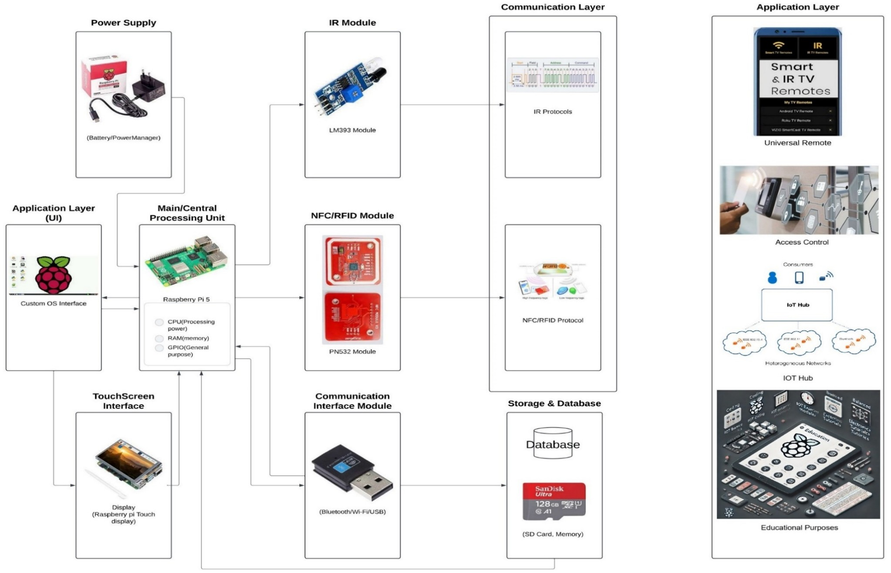

# DigiWizard: A Modular Raspberry Pi-Based Tablet Platform

## Overview

DigiWizard is a Raspberry Pi-based modular tablet platform developed as a Final Year Engineering Project. The primary objective of the project was to create a customizable Linux-powered tablet capable of extending traditional tablet functionality through RFID/NFC and Infrared (IR) communication technologies.

The project combines embedded systems, Linux customization, hardware integration, and software development into a portable educational and experimentation platform.

DigiWizard demonstrates how a Single Board Computer (SBC) can be transformed into a multi-purpose device supporting access control, RFID applications, IR communication, IoT experimentation, and educational use cases.

---

## Project Highlights

* Raspberry Pi 5 based tablet platform
* Waveshare DSI touchscreen integration
* KDE Plasma Mobile inspired user interface
* PN532 NFC/RFID integration
* Custom IR receiver integration
* Linux-based customizable operating system
* Educational and IoT experimentation platform
* Research-oriented hardware and software design

---

## Features

### RFID / NFC Functionality

* PN532 NFC/RFID integration
* RFID tag detection
* Access control experimentation
* Smart authentication use cases

### Infrared Communication

* Custom IR receiver integration
* IR protocol experimentation
* Universal remote use cases
* Signal decoding and analysis

### Linux Customization

* Raspberry Pi OS customization
* KDE Plasma Mobile environment
* Custom configuration management
* Touchscreen optimized interface

### Educational Platform

* Embedded Linux experimentation
* Hardware-software co-design
* IoT prototyping
* Learning and research platform

---

## System Architecture

The system is built around a Raspberry Pi 5 acting as the central processing unit. The platform integrates a touchscreen display, RFID/NFC module, and IR communication module.

These modules communicate through Linux-based software services and communication protocols, enabling use cases such as:

* Access Control
* Universal Remote Functionality
* IoT Integration
* Educational Experimentation

### Architecture Diagram



---

## Hardware Used

| Component                    | Description                  |
| ---------------------------- | ---------------------------- |
| Raspberry Pi 5               | Main processing unit         |
| Waveshare 7" DSI Touchscreen | Display and touch interface  |
| PN532 NFC/RFID Module        | RFID/NFC communication       |
| Custom IR Receiver Module    | Infrared communication       |
| MicroSD Card                 | Operating system and storage |
| Power Supply / Power Bank    | Portable power source        |
| Wi-Fi / Bluetooth            | Connectivity                 |

---

## Project Gallery

### Device Photos

Project photos can be found in:

```text
media/photos/
```

Included photos:

* Device lock screen
* Device rear view
* PN532 RFID module
* Custom IR receiver module
* KDE Control Center
* Custom Settings GUI
* Application launcher view
* Access control interface

### Screenshots

Screenshots can be found in:

```text
media/screenshots/
```

Included screenshots:

* Device interface screenshots
* IR script demonstrations
* Software configuration views
* Application demonstrations

---

## Research Output

### Conference Paper

Research paper associated with the project:

```text
docs/research-paper/
```

### Project Presentation

Presentation slides:

```text
docs/presentation/
```

### Final Year Project Documentation

Project documentation and reports are included within the repository documentation sections.

---

## Challenges Faced

The project involved multiple hardware and software integration challenges:

* Raspberry Pi 5 ecosystem maturity
* RP1 controller compatibility considerations
* Display driver configuration
* Linux operating system customization
* RFID/NFC module integration
* Infrared communication implementation
* Hardware-software co-design challenges
* System stability and testing

These challenges provided valuable experience in debugging, embedded Linux development, and system integration.

---

## Repository Structure

```text
digiwizard-tab-pi/
│
├── README.md
│
├── docs/
│   ├── architecture/
│   ├── research-paper/
│   ├── presentation/
│   ├── bom/
│   └── timeline/
│
├── media/
│   ├── photos/
│   ├── screenshots/
│   └── demo/
│
└── source-code/
```

---

## Initial Setup

Refer to the setup guide:

https://github.com/ppds07/digiwizard-pilet/main/initial_setup.md

---

## Configuration Notes

The provided configuration files are based on Raspberry Pi 5 hardware.

Due to the introduction of the RP1 I/O controller in Raspberry Pi 5, certain configuration options may differ from earlier Raspberry Pi models.

Please review and test configuration changes carefully before deploying them to production systems.

---

## Lessons Learned

This project provided practical experience in:

* Embedded Linux development
* Raspberry Pi system customization
* Hardware integration
* RFID and NFC technologies
* Infrared communication protocols
* Linux debugging and troubleshooting
* Hardware-software co-design
* Research and technical documentation

One of the most important lessons learned during development was that systematic debugging and root-cause analysis are often more effective than repeatedly reinstalling or replacing components.

---

## Future Improvements

Potential future enhancements include:

* Enhanced RFID applications
* Advanced IR communication capabilities
* Improved mobile user interface
* Additional IoT integrations
* Better power management
* Hardware miniaturization
* Expanded educational toolset
* Custom Android-based implementation

---

## Acknowledgements

This project was developed as part of an undergraduate engineering program and served as a platform for exploring embedded systems, Linux customization, and hardware-software integration.

---

## Hardware Configuration

The DigiWizard prototype was built using the following hardware components:

| Component | Purpose |
|------------|------------|
| Raspberry Pi 5 | Main processing unit |
| Waveshare 7" DSI Touchscreen | Primary display and touch interface |
| PN532 NFC/RFID Module | RFID and NFC communication |
| Custom IR Receiver Circuit | Infrared signal reception and decoding |
| MicroSD Card | Operating system and application storage |
| Power Supply / Power Bank | Portable power source |
| Wi-Fi and Bluetooth | Communication and connectivity |

The IR receiver module was custom integrated into the device architecture using a breadboard-based implementation, while the PN532 module provided NFC/RFID capabilities for authentication and experimentation purposes.

---

## Development Journey

DigiWizard evolved through multiple hardware and software iterations during development.

The project involved:

- Linux customization and configuration
- Raspberry Pi display integration
- NFC/RFID module integration
- Custom IR receiver development
- User interface customization
- System testing and debugging

The final prototype demonstrated a working Linux-powered tablet platform capable of supporting RFID/NFC and IR-based applications while maintaining a touch-friendly user experience.
